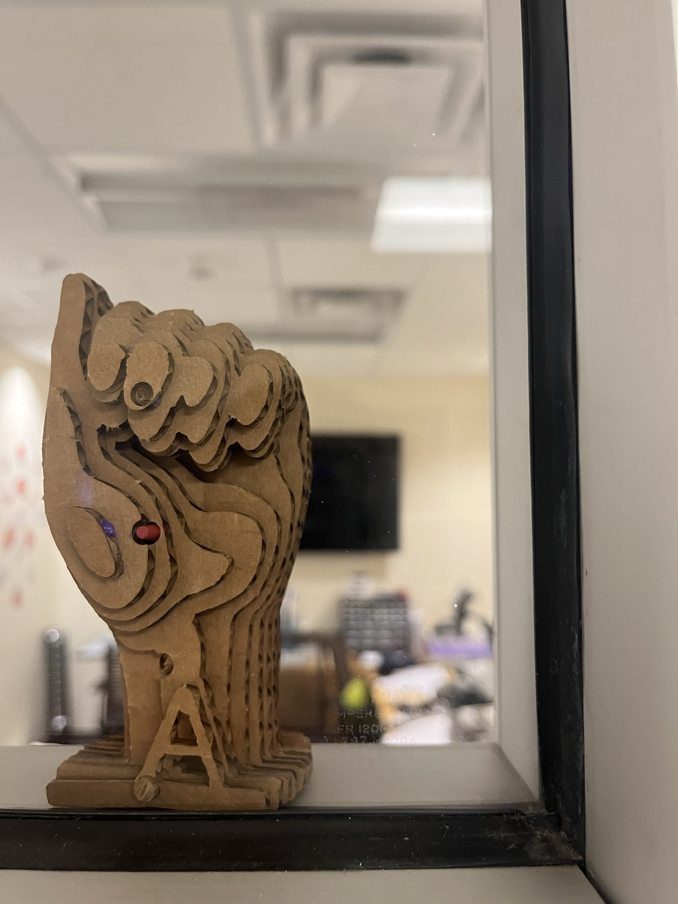

# Slicer
 OpenSCAD stl to svg slicer for laser cut geometries

# Steps
1. Download model and open with meshmixer
2. Run Edit> Make Solid (1.1mm cell size for solid accuracy and 1.4mm cell size for mesh density keep polys and vertice counts around the same) 
3. Making it solid is important to minimize the amount of island pieces in the model 
4. Run analysis > inspector > Auto Repair all 
5. Export stl
6. Open in mesh lab and calculate bounding box coordinates (maybe can do this in meshmixer gui?)
filters> quality measures and computations > compute geometric measures
7. Modify slicer OpenSCAD script with model name and bounding box coordinates
8. Choose vertical or horizontal orientation (modify vert = true or false)
9. Modify dowel thickness for your assembly dowel
10. Run code and render save as an svg
11. Open svg in inkscape or illustrator and release compound path in glow forge software so imports as 12. separate movable pieces group pieces that have islands for easier placement 
13. Laser cut
14. Assemble with dowels and glue, pay close attention to orientation of slices and slice numbers 

# To Do
* Command line interface
* Meshlab automation